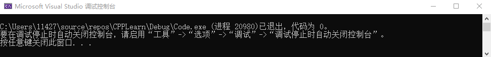

# 《C++ Primer（第五版）》练习记录
- [第1章 开始](#第1章-开始)
- [第2章 变量和基本类型](#第2章-变量和基本类型)

## 第1章 开始
**练习 1.1∶ 查阅你使用的编译器的文档，确定它所使用的文件命名约定。编译并运行第 2页的main 程序。**

没有找到直接与“文件命名约定”相关的文档，但找到了关于VS中**解决方案**是**项目**的容器，即一个解决方案中可以有多个项目，在此就记录下VS和C++在微软的文档吧。

[Document of Visual Studio IDE 2019](https://docs.microsoft.com/zh-cn/visualstudio/get-started/visual-studio-ide?view=vs-2019)  
[Document of C++](https://docs.microsoft.com/zh-cn/cpp/cpp/?view=msvc-160)  

Code:
> CPPLearn\Code\1-1.cpp  
```java
int main() {
	return 0;
}
```
Result:

***
**练习 1.2∶改写程序，让它返回-1。返回值-1 通常被当作程序错误的标识。重新编译并运行你的程序，观察你的系统如何处理 main 返回的错误标识。**
Code:
> CPPLearn\Code\1-2.cpp  
```java
int main() {
	return 0;
}
```
***
## 第2章 变量和基本类型