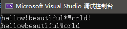
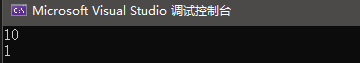

# 《C++ Primer（第五版）》练习记录
- [第1章 开始](#第1章-开始)
	- [**练习 1.1**](#练习-11)
	- [**练习 1.2**](#练习-12)
	- [**练习 1.3**](#练习-13)
	- [**练习 1.4**](#练习-14)
	- [**练习 1.5**](#练习-15)
	- [**练习 1.6**](#练习-16)
	- [**练习 1.7**](#练习-17)
	- [**练习 1.8**](#练习-18)
	- [**练习 1.9**](#练习-19)
	- [**练习 1.10**](#练习-110)
	- [**练习 1.11**](#练习-111)
	- [**练习 1.12**](#练习-112)
	- [**练习 1.13**](#练习-113)
	- [**练习 1.14**](#练习-114)
	- [**练习 1.15**](#练习-115)
	- [**练习 1.16**](#练习-116)
	- [**练习 1.17**](#练习-117)
	- [**练习 1.18**](#练习-118)
	- [**练习 1.19**](#练习-119)
	- [**练习 1.20**](#练习-120)
	- [**练习 1.21**](#练习-121)
	- [**练习 1.22**](#练习-122)
	- [**练习 1.23**](#练习-123)
	- [**练习 1.24**](#练习-124)
	- [**练习 1.25**](#练习-125)
- [第2章 变量和基本类型](#第2章-变量和基本类型)
	- [**练习 2.1**](#练习-21)
	- [**练习 2.2**](#练习-22)
	- [**练习 2.3**](#练习-23)
	- [**练习 2.4**](#练习-24)
	- [**练习 2.5**](#练习-25)
	- [**练习 2.6**](#练习-26)
	- [**练习 2.7**](#练习-27)
	- [**练习 2.8**](#练习-28)
	- [**练习 2.10**](#练习-210)
	- [**练习 2.11**](#练习-211)
	- [**练习 2.12**](#练习-212)
	- [**练习 2.13**](#练习-213)
	- [**练习 2.14**](#练习-214)
	- [**练习2.15**](#练习215)
	- [**练习2.16**](#练习216)
	- [**练习2.18**](#练习218)
	- [**练习2.19**](#练习219)
	- [**练习2.20**](#练习220)
	- [**练习 2.21**](#练习-221)
	- [**练习 2.22**](#练习-222)
	- [**练习 2.23**](#练习-223)
	- [**练习 2.24**](#练习-224)
	- [**练习 2.25**](#练习-225)
	- [**练习 2.26**](#练习-226)
	- [**练习 2.27**](#练习-227)
	- [**练习 2.28**](#练习-228)
	- [**练习 2.29**](#练习-229)
	- [**练习 2.30**](#练习-230)
	- [**练习 2.31**](#练习-231)
	- [**练习 2.32**](#练习-232)
	- [**练习 2.33**](#练习-233)
	- [**练习 2.34**](#练习-234)
	- [**练习 2.35**](#练习-235)
	- [**练习 2.36**](#练习-236)
	- [**练习 2.37**](#练习-237)
	- [**练习 2.38**](#练习-238)
	- [**练习 2.39**](#练习-239)
	- [**练习 2.40**](#练习-240)
	- [**练习 2.41**](#练习-241)
	- [**练习 2.42**](#练习-242)
- [# 第三章 字符串、向量和数组](#-第三章-字符串向量和数组)
	- [**练习3.1**](#练习31)
	- [**练习3.2**](#练习32)
	- [**练习3.3**](#练习33)
	- [**练习3.4**](#练习34)
	- [**练习3.5**](#练习35)
	- [**练习3.6**](#练习36)
	- [**练习3.7**](#练习37)
	- [**练习3.8**](#练习38)
	- [**练习3.9**](#练习39)
	- [**练习3.10**](#练习310)
	- [**练习3.11**](#练习311)
	- [**练习3.12**](#练习312)
	- [**练习3.13**](#练习313)
	- [**练习3.14**](#练习314)
	- [**练习3.15**](#练习315)
	- [**练习3.16**](#练习316)
	- [**练习3.17**](#练习317)
	- [**练习3.18**](#练习318)
	- [**练习3.19**](#练习319)
	- [**练习3.20**](#练习320)
	- [**练习3.21**](#练习321)
	- [**练习3.22**](#练习322)
	- [**练习3.23**](#练习323)
	- [**练习3.24**](#练习324)
	- [**练习3.25**](#练习325)
	- [**练习3.26**](#练习326)
	- [**练习3.27**](#练习327)
	- [**练习3.28**](#练习328)
	- [**练习3.29**](#练习329)
	- [**练习3.30**](#练习330)
	- [**练习3.31**](#练习331)
	- [**练习3.32**](#练习332)
	- [**练习3.33**](#练习333)
	- [**练习3.34**](#练习334)
	- [**练习3.35**](#练习335)
	- [**练习3.36**](#练习336)
	- [**练习3.37**](#练习337)
	- [**练习3.38**](#练习338)
	- [**练习3.39**](#练习339)
	- [**练习3.40**](#练习340)
	- [**练习3.41**](#练习341)
	- [**练习3.42**](#练习342)
	- [**练习3.43**](#练习343)
	- [**练习3.44**](#练习344)
	- [**练习3.45**](#练习345)
- [第4章 表达式](#第4章-表达式)
	- [**练习4.1**](#练习41)
	- [**练习4.2**](#练习42)
	- [**练习4.3**](#练习43)
	- [**练习4.4**](#练习44)
	- [**练习4.5**](#练习45)
	- [**练习4.6**](#练习46)
	- [**练习4.7**](#练习47)
	- [**练习4.8**](#练习48)
	- [**练习4.9**](#练习49)
	- [**练习4.10**](#练习410)
	- [**练习4.11**](#练习411)
	- [**练习4.12**](#练习412)
	- [**练习4.13**](#练习413)
	- [**练习4.14**](#练习414)
	- [**练习4.15**](#练习415)
	- [**练习4.16**](#练习416)
	- [**练习4.17**](#练习417)
	- [**练习4.18**](#练习418)
	- [**练习4.19**](#练习419)
	- [**练习4.20**](#练习420)
	- [**练习4.21**](#练习421)
	- [**练习4.22**](#练习422)
	- [**练习4.23**](#练习423)
	- [**练习4.24**](#练习424)
	- [**练习4.25**](#练习425)
	- [**练习4.26**](#练习426)
	- [**练习4.27**](#练习427)
	- [**练习4.28**](#练习428)
	- [**练习4.29**](#练习429)
	- [**练习4.30**](#练习430)
	- [**练习4.31**](#练习431)
	- [**练习4.32**](#练习432)
	- [**练习4.33**](#练习433)
	- [**练习4.34**](#练习434)
	- [**练习4.35**](#练习435)
	- [**练习4.36**](#练习436)
	- [**练习4.37**](#练习437)
	- [**练习4.38**](#练习438)

## 第1章 开始
### **练习 1.1**
>查阅你使用的编译器的文档，确定它所使用的文件命名约定。编译并运行第 2页的main 程序。

没有找到直接与“文件命名约定”相关的文档，但找到了关于VS中**解决方案**是**项目**的容器，即一个解决方案中可以有多个项目，在此就记录下VS和C++在微软的文档吧。

[Document of Visual Studio IDE 2019](https://docs.microsoft.com/zh-cn/visualstudio/get-started/visual-studio-ide?view=vs-2019)  
[Document of C++](https://docs.microsoft.com/zh-cn/cpp/cpp/?view=msvc-160)  

Code:
> CPPLearn\Code\1-1  
```java
int main() {
	return 0;
}
```
Result:

***
### **练习 1.2**
>改写程序，让它返回-1。返回值-1 通常被当作程序错误的标识。重新编译并运行你的程序，观察你的系统如何处理 main 返回的错误标识。  

Code:
> CPPLearn\Code\1-2  
```java
int main() {
	return -1;
}
```  
Result:  

  
对比1-1，会以-1作为退出代码。
***
### **练习 1.3**
>编写程序，在标准输出上打印Hello，World。

Code:
> CPPLearn\Code\1-3
```C++
#include<iostream>
int main() {
	std::cout << "Hellow,World!" << std::endl;
	return 0;
}
```
Result:

***

### **练习 1.4**
>我们的程序使用加法运算符+来将两个数相加。编写程序使用乘法运算符\*，来打印两个数的积。  
Code:
>CPPLearn\code\1-4
```c++
#include<iostream>
int main() {
	std::cout << "Please enter two numbers:" << std::endl;
	int v1=0, v2=0;
	std::cin >> v1 >> v2;
	std::cout << "The product of " << v1 << " and " << v2 << " is " << v1 * v2 << std::endl;
	return 0;
}
```
Result:

***
### **练习 1.5**
>我们将所有输出操作放在一条很长的语句中。重写程序，将每个运算对象的打印操作放在一条独立的语句中。

Code:
> CPPLearn\code\1-5
```c++
#include<iostream>
int main() {
	std::cout << "Please enter two numbers:";
	std::cout << std::endl;
	int v1 = 0, v2 = 0;
	std::cin >> v1 >> v2;
	std::cout << "The product of ";
	std::cout << v1;
	std::cout << " and ";
	std::cout << v2;
	std::cout << " is ";
	std::cout << v1 * v2;
	std::cout << std::endl;
	return 0;
}
```
Result:

***
### **练习 1.6**
>解释下面程序片段是否合法。
>```c++
>std: :cout << "The sum of " << v1;
>		<< " and " << v2;
>		<<" is "<< v1 + v2 << std::endl;
>```如果程序是合法的，它输出什么? 如果程序不合法，原因何在?应该如何修正?
不合法，可以写入程序编译其中发现会爆红并通过不了编译：  
  
输出为：  
  
原因在于，<<输出运算法需接受两个对象，即<<是一个二元运算符，这种写法不满足，属于语法错误。应将除最后一行的分号删去，即  
```c++
std::cout << "The sum of " << v1
		<< " and " << v2
		<< " is " << v1 + v2 << std::endl;
```
***
### **练习 1.7**
>编译一个包含不正确的嵌套注释的程序，观察编译器返回的错误信息。  
Code:
```c++
int main() {
	/*/*嵌套注释测试*/*/
	return 0;
}
```
Result:
  
会将第一个/\*和第一个\*/识别为一组，剩下的一个*/视为语法错误。
***
### **练习 1.8**
>指出下列哪些输出语句是合法的（如果有的话）∶
>```c++
>std::Cout <<"/*"; 
>std::cout <<"*/";
>std::cout <</*"*/" */;
>std::cout <</*"*/" / * "/*"*/;
>```
>预测编译这些语句会产生什么样的结果，实际编译这些语句来验证你的答案（编写一个小程序，每次将上述一条语句作为其主体），改正每个编译错误。  

预测第一句会输出"/\*"，第二句输出"\*/",第三句报错，因为一对注释符号的包裹下回失去一个"（引号）导致错误，第三个会输出"/*"。  
Result:
  


  
基本符合预期，修改：可以在第三局分号前加一个引号即可，输出为\*/
```c++
	std::cout <</*"*/"*/";
```
***
### **练习 1.9**
>编写程序，使用while循环将 50 到100 的整数相加。

Code:
```c++
#include<iostream>
int main() {
	int i = 50,sum=0;
	while (i <= 100) {
		sum += i;
		i++;
	}
	std::cout << "Sum of 50 to 100 inclusive is " << sum << std::endl;
	return 0;
}
```  
Result:

***
### **练习 1.10**
>除了++运算符将运算对象的值增加 1 之外，还有一个递减运算符（―）实现将值减少 1。编写程序，使用递减运算符在循环中按递减顺序打印出 10 到 0 之间的整数。

Code:
```c++
#include<iostream>
int main() {
	int i =10;
	while (i >= 0) {
		std::cout << i-- <<" " ;
	}
	std::cout<<std::endl;
	return 0;
}
```
Result:  

***
### **练习 1.11**
>编写程序，提示用户输入两个整数，打印出这两个整数所指定的范围内的所有整数。

Code:
```c++
#include<iostream>
int main() {
	int l = 0,r=0;
	std::cout << "Enter two numbers,I will return the numbers between them."<<std::endl;
	std::cin >> l >> r;
	while (l <= r) {
		std::cout << l++ << " ";
	}
	std::cout << std::endl;
	return 0;
}
```

***
### **练习 1.12**
>下面的 for 循环完成了什么功能?sum的终值是多少?
>```c++
>int sum = 0;
>for (int i = -100;i <= 100;++i)
>	sum ＋= i;

完成了-100-100的累加，结果为0。
***
### **练习 1.13**
>使用 for循环重做1.4.1 节中的所有练习（第 11 页）。

Code:
```c++
#include<iostream>
int main() {
	int i=0, l=0, r=0, sum=0;
	std::cout << "for实现1.9" << std::endl;
	for (i = 50; i <= 100; i++) {
		sum += i;
	}
	std::cout <<"50-100整数之和为"<< sum << std::endl<<"for实现1.10"<<std::endl;
	for (i = 10; i >= 0; i--) {
		std::cout << i << " ";
	}
	std::cout << std::endl << "for实现1.11"<<std::endl << "请输入两个整数,此处将输出二者间的所有整数" << std::endl;
	std::cin >> l >> r;
	for (; l <= r; l++) {
		std::cout << l << " ";
	}
	return 0;
}
```
Result:

### **练习 1.14**
>对比 for 循环和 while 循环，两种形式的优缺点各是什么?


for相比while可以更规范的实现迭代器的初始化和迭代，更适用于“检测变量，递增变量”的模式。  
while相比for使用起来也更轻便，而且可以设置多种迭代变化，更加灵活。

***
### **练习 1.15**
>编写程序，包含第 14 页"再探编译"中讨论的常见错误。熟悉编译器生成的错误信息。
```c++
#include<iostream>
//语法错误示范
//正确示范
//int main() {
//错误示范：main的参数列表漏掉了
int main（{
	//正确示范
	//std::cout << "Read each file." << std::endl;
	//错误示范：endl后使用了冒号而非分号
	std::cout<<"Read each file."<<std::endl:
	//正确示范
	//std::cout << "Update master" << std::endl;
	//错误示范
	std::cout << Update master << std::end1;
	//正确示范
	//std::cout << "Write new master" << std::endl;
	//错误示范：漏掉了第二个输出运算符
	std::cout << "Write new master." std::endl;
	
	//类型错误示范
	int a = 10;
	//错误将字符串传给int
	a = "hello";

	//声明错误
	int v1 = 0, v2 = 0;
	std::cin >> v >> v2;
	cout << v1 + v2 << std::endl;
	//正确示范
	//return 0;
	//错误示范
	return 0
}
```
Result:

***
### **练习 1.16**
>编写程序，从cin读取一组数，输出其和。

Code:
```c++
#include<iostream>
int main() {
	int v=0, sum=0;
	while (std::cin >> v)
		sum += v;
	std::cout << "sun is " << sum << std::endl;
	return 0;
}
```
Result:

***
### **练习 1.17**
>如果输入的所有值都是相等的，本节的程序会输出什么?如果没有重复值，输出又会是怎样的?

当输入的所有值相等时输出的是，其中n是输入的值，m为输入的个数、
```
n occurs m times
```
当输入都不重复时，其中n为每一个输入的值
```
n occurs 1 times
```
***
### **练习 1.18**
>编译并运行本节的程序，给它输入全都相等的值。再次运行程序，输入没有重复的值。

Code：
```c++
#include<iostream>
int main() {
	int currVal = 0, val= 0;
	if (std::cin >> currVal) {
		int cnt = 1;
		while (std::cin >> val) {
			if (val == currVal) {
				cnt++;
			}
			else {
				std::cout << currVal << " occurs " << cnt << " times " << std::endl;
				currVal = val;
				cnt = 1;
			}
		}
		std::cout << currVal << " occurs " << cnt << " times " << std::endl;
	}
	return 0;
}
```
Result:  


***
### **练习 1.19**
>修改你为1.4.1 节练习1.10（第 11 页）所编写的程序（打印一个范围内的数），使其能处理用户输入的第一个数比第二个数小的情况。

(感觉题目错了，第一应该是1.11,第二应该是第一个比第二个大的情况)  
Code:
```c++
#include<iostream>
int main() {
	int l = 0, r = 0;
	std::cout << "Enter two numbers,I will return the numbers between them." << std::endl;
	std::cin >> l >> r;
	if (l > r) {
		int t = l;
		l = r;
		r = t;
	}
	while (l <= r) {
		std::cout << l++ << " ";
	}
	std::cout << std::endl;
	return 0;
}
```

Result:  

***
### **练习 1.20**
>在网站 http∶//www.informit.com/title/0321714113 上，第1章的代码目录中包含了头文件 Sales item.h。将它拷贝到你自己的工作目录中。用它编写一个程序，读取一组书籍销售记录，将每条记录打印到标准输出上。

Code:
```c++
#include <iostream>
#include "Sales_item.h"
int main() {
	Sales_item item;
	int i=1;
	while (std::cin >> item) {
		std::cout << "第" << i++ << "条记录是" << item << std::endl;
	}
	return 0;
}
```
Result:


***
### **练习 1.21**
>编写程序，读取两个 工SBN 相同的 Sales item 对象，输出它们的和。

Code:
```c++
#include <iostream>
#include "Sales_item.h"
int main() {
	Sales_item item1,item2;
	std::cin >> item1 >> item2;
	if (item1.isbn() == item2.isbn()) {
		std::cout << item1 + item2 << std::endl;
		return 0;
	}
	else {
		std::cerr << "Data must be the same ISNB" << std::endl;
		return -1;
	}
}
```

Result:

***
### **练习 1.22**
>编写程序，读取多个具有相同ISBN 的销售记录，输出所有记录的和。

Code:
```c++
#include <iostream>
#include "Sales_item.h"
int main() {
	Sales_item total,item;
	if (std::cin >> total) {
		while (std::cin >> item) {
			if (total.isbn() == item.isbn()) {
				total += item;
			}
			else {
				std::cout << "sum is " << total << std::endl;
				total = item;
			}
		}
		std::cout << "sum is " << total << std::endl;
		return 0;
	}
	else {
		std::cerr << "数据不足量" << std::endl;
		return -1;
	}
}
```
Result:

*小问题：现在这样的输入输出略丑，能不能实现在输入完成后再输出？*
***
### **练习 1.23**
>编写程序，读取多条销售记录，并统计每个ISBN（每本书）有几条销售记录。

Code:
```c++
#include <iostream>
#include "Sales_item.h"
int main() {
	Sales_item total, item;
	int cnt = 1;
	if (std::cin >> total) {
		while (std::cin >> item) {
			
			if (total.isbn() == item.isbn()) {
				cnt++;
			}
			else {
				std::cout << "ISBN为" <<total.isbn()<<"的记录有"<< cnt <<"条"<< std::endl;
				total = item;
				cnt = 1;
			}
		}
		std::cout << "ISBN为" << total.isbn() << "的记录有" << cnt << "条" << std::endl;
		return 0;
	}
	else {
		std::cerr << "数据不足量" << std::endl;
		return -1;
	}
}
```

Result:

***
### **练习 1.24**
>输入表示多个 ISBN 的多条销售记录来测试上一个程序，每个ISBN 的记录应该聚在一起。

没怎么看出来和上题有什么区别，可能是想让我们练练文件重定向？
要是不用vs的话可以直接 
```bash
[编译出来的exe程序名] <in.txt >out.txt
```
vs话得打开 项目-属性-配置属性-调试-命令参数 中输入<in.txt >out.txt，再在in.txt中输入数据，即可，如图：


Result:

***
### **练习 1.25**
>借助网站上的 Sales item.h头文件，编译并运行本节给出的书店程序。
目测和我写的1.22差不多，不赘述了。

***
## 第2章 变量和基本类型
### **练习 2.1**
>类型int、long、long long和 short 的区别是什么?无符号类型和带符号类型的区别是什么? float 和 double 的区别是什么?

1. 最小尺寸不同，int short16字节，long32字节，long long64字节。
2. 区别在于：
   1. 写法上：带符号类型通常没有前缀，无符号的须要在带符号类型名前加上unsigned即可，字符型的带符号与无符号比较特殊有char，signchar，unsigned char三种类型，但字符表现类型却只有两种。
   2. 数值上：带符号可以表示正数、负数、0，无符号只能表示大于等于零的值。
3. 也是最小尺寸的区别，double要更长，但实际上double更受到欢迎。
### **练习 2.2**
>计算按揭贷款时，对于利率、本金和付款分别应选择何种数据类型?说明你的理由。

分别用unsigned float，unsigned int，unsigned double来存，利率精度要求不高，也就小数后两三位且为正数，unsigned float足矣，本金一般为整数且数额较大为正数且不超过int的范围，所以用unsigned int,付款的金额也较大，也有一定的精度要求所以选用unsigned fouble。
***
### **练习 2.3**
读程序写结果。
```c++
	unsigned u = 10, u2 = 42;
	std::cout << u2 - u << std::endl;
	std::cout << u - u2 << std::endl;
	int i = 10, i2 = 42;
	std::cout << i2 - i << std::endl;
	std::cout << i - i2 << std::endl;
	std::cout << i - u << std::endl;
	std::cout << u - i << std::endl;
```
预期32,4294967264,32,-32,0,0
***
### **练习 2.4**
>编写程序检查你的估计是否正确，如果不正确，请仔细研读本节直到弄明白问题所在。

Code:
```c++
#include<iostream>
int main() {
	unsigned u = 10, u2 = 42;
	std::cout << u2 - u << std::endl;
	std::cout << u - u2 << std::endl;
	int i = 10, i2 = 42;
	std::cout << i2 - i << std::endl;
	std::cout << i - i2 << std::endl;
	std::cout << i - u << std::endl;
	std::cout << u - i << std::endl;
}
```
Result:  
  
没错符合预期。
***
### **练习 2.5**
>指出下述字面值的数据类型并说明每一组内几种字面值的区别∶  
>(a) 'a',L'a',"a",L"a"  
>(b) 10,10u,10L,10uL,012,0xC  
>(c)3.14,3.14f,3.14L  
>(d) 10,10u,10.,10e-2  
***
1. 字符字面值a，wchar_t型字符字面值a，字符串字面值a，wchar_t型字符串字面值a
2. int型整型字面值10，unsigned int型整型字面值10，long型整型字面值10，unsigned long型整型字面值10，八进制表示的整型字面值10，十六进制表示的整型字面值12
3. double型浮点型字面值，float型浮点型字面值，long double型浮点型字面值
4. int型整型字面值10，unsigned int型整型字面值10，小数点表示的double型浮点型字面值10，科学计数法表示的double字面值0.1
### **练习 2.6**
>下面两组定义是否有区别，如果有，请叙述之∶  
>int month = 9,day = 7;   
>int month = 09,day = 07;

有区别，上面一行是通过十进制表示的字面量，下面是八进制，且在字段month上是无效的9已经大于8  

### **练习 2.7**
>下述字面值表示何种含义?它们各自的数据类型是什么?  
>(a) "Who goes with F\145rgus?\012"  
>(d) 3.14e1L  
>(b) 1024f  
>(c) 3.14L

1. Who goes with Fergus? 字符串字面值
2. 31.4 long double型浮点型字面值
3. 1024.0 float型浮点型字面值
4. 3.14 long double型浮点型字面值
***
### **练习 2.8**
请利用转义序列编写一段程序，要求先输出 2M，然后转到新一行。修改程序使其先输出 2，然后输出制表符，再输出 M，最后转到新一行。

Code:
```c++
#include<iostream>
int main() {
	std::cout << 2 << "\115\12";
	std::cout << 2 << "\t\115\12";
	return 0;
}
```
Result:  

***
###**练习 2.9**
>解释下列定义的含义。对于非法的定义，请说明错在何处并将其改正。  
(a) std::cin >> int input_value;
(b) int i= {} 3.14 };  
(c)double salary = wage = 9999.99;  
(d)int i = 3.14;

1. 非法这题能体现出赋值和初始化的区别，>>输入运算符的工作是将输入流istream中的数据赋值给>>右边的变量，而对变量赋值并不是初始化工作。也就是说该变量未经初始化，因而报错。应改为
```c++
int input_value;
std::cin >> input_value;
```
2. 非法，因为列表初始化存在丢失信息的风险。应该为：
```c++
int i=(3.14);
```
3. 非法，error: ‘wage’ was not declared in this scope，这条表达式的意思是将9999.99赋值给wage这个变量，然后用wage这个变量来初始化这个salary变量。由于在赋值操作时，编译器未找到wage这个变量，那么就会报错。应改为：
```c++
double wage;
double salary = wage = 9999.99;
```
4. 没毛病
### **练习 2.10**
>下列变量的初值分别是什么?
>```c++
>std: :string global_str; 
>int global_int; 
>int main ()
>{
>	int local_int;
>	std::string local_str;
>}
>
>```

猜测是 空串，0，undefined，undefined，实验可得，有一些偏差，global_str和local_str都为空串（因为类本身就这么定义），int为内置类型，在函数外会被初始化为0，在函数内未被初始化为undefined。
***
### **练习 2.11**
>指出下面的语句是声明还是定义∶  
(a)extern int ix = 1024;  
(b) int iy;  
(c) extern int iz;

定义（虽然有extern但进行了初始化）、定义、声明
***
### **练习 2.12**
>请指出下面的名字中哪些是非法的?  
(a) int double = 3.14;  
(b) int _;  
(c) int catch-22;  
(d) int 1_or_2 = 1;  
(e) double Double = 3.14;

acd是非法的，a关键字冲突，c使用了减号而非下划线，d数字开头不合法。
***
### **练习 2.13**
>下面程序中j的值是多少?
>```c++
>int i = 42;
>int main()
>{
>    int i = 100;
>    int j = i;
>}
>```

100

***
### **练习 2.14**
>下面的程序合法吗?如果合法，它将输出什么?
>```c++
>int i = 100, sum = 0;
>for (int i = 0; i != 10; ++i)
>    sum += i;
>std::cout << i << " " << sum << std::endl;
>```

100 45
***
### **练习2.15**
>下面的哪个定义是不合法的？为什么？
>- (a) int ival = 1.01;
>- (b) int &rval1 = 1.01;
>- (c) int &rval2 = ival;
>- (d) int &rval3;
***
1. 合法
2. 不合法，引用只能绑定在对象上
3. 合法
4. 不合法，引用必须被初始化

###  **练习2.16**
>考察下面的所有赋值然后回答：哪些赋值是不合法的？为什么？哪些赋值是合法的？它们执行了哪些操作？
>
>```cpp
>int i = 0, &r1 = i; 
>double d = 0, &r2 = d;
>```
>- (a) r2 = 3.14159;
>- (b) r2 = r1;
>- (c) i = r2;
>- (d) r1 = d;
- (a) 合法，给d赋值3.14159
- (b) 合法，给d赋值0，且发生强制类型转化（int->double）
- (c) 合法，给i赋值0，且发生强制转化（double->int，截去小数位）
- (d) 合法，给i赋值0，且发生强制转化（double->int，截去小数位）
***
>### **练习2.17**
>执行下面的代码段将输出什么结果？
>```cpp
>int i, &ri = i;
>i = 5; ri = 10;
>std::cout << i << " " << ri << std::endl;
>```
10 10
***
### **练习2.18**
>编写代码分别改变指针的值以及指针所指对象的值。
```cpp
int val1=1,val2=2;
int *p1=0,*p2=0;

//改变指针的值
p1=&val1;
p2=&val2;
//改变指针所指对象的值
*p2=*p1;
```
***
### **练习2.19**
>说明指针和引用的主要区别  

引用其实就是别名，指针是一种用来存储对象位置的对象，  
引用必须被初始化，且完成就不可修改。指针则无需如此。
***
### **练习2.20**
>请叙述下面这段代码的作用。
>
>```cpp
>int i = 42;
>int *p1 = &i; 
>*p1 = *p1 * *p1;
>```

求42*42的结果

***
### **练习 2.21**
>请解释下述定义。在这些定义中有非法的吗？如果有，为什么？
>`int i = 0;`
>- (a) double* dp = &i;
>- (b) int *ip = i;
>- (c) int *p = &i;

- a 非法，指针类型不同
- b 非法，不能将int变量赋值给指针
- c 合法，
***
### **练习 2.22**
>假设 p 是一个 int 型指针，请说明下述代码的含义。
>
>```cpp
>if (p) // 如果p非空指针则...
>if (*p) // 如果p所指对象非0则...
>```
***
### **练习 2.23**
>给定指针 p，你能知道它是否指向了一个合法的对象吗？如果能，叙述判断的思路；如果不能，也请说明原因。

不能，得首先确实p的合法性，才能确认其所指对象的合法性
***
### **练习 2.24**
在下面这段代码中为什么 p 合法而 lp 非法？
>```cpp
>int i = 42;
>void *p = &i;
>long *lp = &i;
>```

指针和被指向的对象类型必须匹配所以lp非法，而void比较特殊，可以指向任何类型的对象所以p合法
***
### **练习 2.25**
> 说明下列变量的类型和值。
> ```cpp
> (a) int* ip, i, &r = i;
> (b) int i, *ip = 0;
> (c) int* ip, ip2;
>```

- a ip是指向int型对象的指针，i是int型对象，r是i的引用
- b i是int型对象，ip是空指针
- c ip是指向int的指针，ip2是int
***
### **练习 2.26**
>下面哪些语句是合法的？如果不合法，请说明为什么？
>
>```cpp
>const int buf;      // 不合法, const 对象必须初始化
>int cnt = 0;        // 合法
>const int sz = cnt; // 合法
>++cnt; ++sz;        // 不合法, const 对象不能被改变
>```
***
### **练习 2.27**
>下面的哪些初始化是合法的？请说明原因。
>```cpp
>int i = -1, &r = 0;         // 不合法, r 必须引用一个对象
>int *const p2 = &i2;        // 合法，常量指针
>const int i = -1, &r = 0;   // 合法
>const int *const p3 = &i2;  // 合法
>const int *p1 = &i2;        // 合法
>const int &const r2;        // 不合法, r2 是引用，引用没有顶层 const，即有对常量的应用，而没有引用的常量
>const int i2 = i, &r = i;   // 合法
>```
***

### **练习 2.28**
>说明下面的这些定义是什么意思，挑出其中不合法的。
>```cpp
>int i, *const cp;       // 不合法, const 指针必须初始化
>int *p1, *const p2;     // 不合法, const 指针必须初始化
>const int ic, &r = ic;  // 不合法, const int 必须初始化
>const int *const p3;    // 不合法, const 指针必须初始化
>const int *p;           // 合法. 一个指针，指向 const int
>```
***
### **练习 2.29**
>假设已有上一个练习中定义的那些变量，则下面的哪些语句是合法的？请说明原因。
>```cpp
>i = ic;     // 合法, 常量赋值给普通变量
>p1 = p3;    // 不合法, p3 是const指针不能赋值给普通指针
>p1 = &ic;   // 不合法, 普通指针不能指向常量
>p3 = &ic;   // 不合法, p3 是常量指针，已被初始化不可再赋值
>p2 = p1;    // 不合法, p2 是常量指针，已被初始化不可再赋值
>ic = *p3;   // 合法, 对 p3 取值后是一个const int 然后赋值给 ic
>```
***
 

### **练习 2.30**
>对于下面的这些语句，请说明对象被声明成了顶层const还是底层const？
>
>```cpp
>const int v2 = 0; int v1 = v2;
>int *p1 = &v1, &r1 = v1;
>const int *p2 = &v2, *const p3 = &i, &r2 = v2;
>```
v1都不是 v2顶层const，p1，r1啥都不是，p2底层const，p3既是顶层const又是底层const，r2底层const
***

### **练习 2.31**
>假设已有上一个练习中所做的那些声明，则下面的哪些语句是合法的？请说明顶层const和底层const在每个例子中有何体现。
>```cpp
>r1 = v2; // 合法, 顶层const在拷贝时不受影响
>p1 = p2; // 不合法, p2 是底层const，如果要拷贝必须要求 p1 也是底层const
>p2 = p1; // 合法, int* 可以转换成const int*
>p1 = p3; // 不合法, p3 是一个底层const，p1 不是
>p2 = p3; // 合法, p2 和 p3 都是底层const，拷贝时忽略掉顶层const
>```
***

### **练习 2.32**
>下面的代码是否合法？如果非法，请设法将其修改正确。
>```cpp
>int null = 0, *p = null;
>```

不合法
```cpp
int null = 0，*p = &null;
```
***

### **练习 2.33**
利用本节定义的变量，判断下列语句的运行结果。
>```cpp
>a=42; // a 是 int,a=42
>b=42; // b 是一个 int,(ci的顶层const在拷贝时被忽略掉了) b=42
>c=42; // c 也是一个int c=42
>d=42; // d 是一个 int *,所以语句非法
>e=42; // e 是一个 const int *, 所以语句非法
>g=42; // g 是一个 const int &，引用都是底层const，所以不能被赋值
>```
***

### **练习 2.34**
>基于上一个练习中的变量和语句编写一段程序，输出赋值前后变量的内容，你刚才的推断正确吗？如果不对，请反复研读本节的示例直到你明白错在何处为止。

Code:
```cpp
#include <iostream>
int main()
{
    int i = 0, & r = i;
    auto a = r;   

    const int ci = i, & cr = ci;
    auto b = ci; 
    auto c = cr; 
    auto d = &i; 
    auto e = &ci; 

    const auto f = ci; 
    auto& g = ci; 

    a = 42; b = 42; c = 42;

    return 0;
}
```
Result:  
  
基本符合预期
***
### **练习 2.35**
>判断下列定义推断出的类型是什么，然后编写程序进行验证。
>
>```cpp
>const int i = 42;
>auto j = i; const auto &k = i; auto *p = &i; 
>const auto j2 = i, &k2 = i;
>```

预测：  
	i->const int;  
	j->int;  
	k->const int &;  
	p->int *;  
	j2->const int;  
	k2->const int &;  
Code:  
```cpp
#include <iostream>
int main()
{
    const int i = 42;
    auto j = i; const auto &k = i; auto *p = &i;
    const auto j2 = i, & k2 = i;
    return 0;
}
```
Result:  
  
!!!目测除了p应该都是对的。
总结：  
const或auto 会对每个逗号签的声明符进行修饰，
\* \& 只从属某一个声明符
auto会忽略顶层contst，而在auto *p=\&i;中const int *的const是底层const（p所指的对象是一个常量）
***

### **练习 2.36**
>关于下面的代码，请指出每一个变量的类型以及程序结束时它们各自的值。
>
>```cpp
>int a = 3, b = 4;
>decltype(a) c = a;
>decltype((b)) d = a;
>++c;
>++d;
>```

|     |       |     |
| --- | ----- | --- |
| a   | int   | 4   |
| b   | int   | 4   |
| c   | int   | 4   |
| d   | int & | 4   |

***

### **练习 2.37**
>赋值是会产生引用的一类典型表达式，引用的类型就是左值的类型。也就是说，如果 i 是 int，则表达式 i=x 的类型是 int&。根据这一特>点，请指出下面的代码中每一个变量的类型和值。
>
>```cpp
>int a = 3, b = 4;
>decltype(a) c = a;
>decltype(a = b) d = a;
>```

|     |       |     |
| --- | ----- | --- |
| a   | int   | 3   |
| b   | int   | 4   |
| c   | int   | 3   |
| d   | int & | 3   |
***

### **练习 2.38**
>说明由decltype 指定类型和由auto指定类型有何区别。请举一个例子，decltype指定的类型与auto指定的类型一样；再举一个例子，decltype指定的类型与auto指定的类型不一样。

区别：
1. 若decltype使用的表达式是一个变量则decltype返回该变量的类型（包括顶层const和引用在内），而auto则会忽略顶层const，如果设置一个类型为auto的引用时，初始值中的顶层常量属性任然保留。
2. 如果表达式的内容是解引用操作，则decltype将会得到引用类型。decltype的结果类型与表达式形式密切相关。

举例：
```cpp
#include<iostream>
int main() {
	const int a = 1;
	auto b = a;
	decltype(a) c=a;
	const auto d = a;
	//其中a->const int,b->int,c->const int,d->const int
	const int& r = a;
	auto p = r;//实际上此处的r就是a，所以p的类型是int
	decltype(r) k = a;//因为decltype比较特殊，还是把r看做是r
	//其中r->cosnt int &,p->int,k->const int &
	const int* j = &a;
	auto i = j;
	decltype(j) n = 0;
	//相同的举例i->const int *,j->const int *,n->const int *
	return 0;
}
```
Result:  

***

### **练习 2.39**
>编译下面的程序观察其运行结果，注意，如果忘记写类定义体后面的分号会发生什么情况？记录下相关的信息，以后可能会有用。
>```cpp
>struct Foo { /* 此处为空  */ } // 注意：没有分号
>int main()
>{
>    return 0;
>}
>```

Result:  

***

### **练习 2.40**
>根据自己的理解写出 Sales_data 类，最好与书中的例子有所区别。

```cpp
struct Sale_data
{
    std::string isbn;
    unsigned units_sold = 0;
    double price = 0.0;
    double revenue = 0.0;
};
```
***

### **练习 2.41**
>使用你自己的Sale_data类重写1.5.1节（第20页）、1.5.2节（第21页）和1.6节（第22页）的练习。眼下先把Sales_data类的定义和main函数放在一个文件里。
```c++
#include<iostream>
struct Sale_data
{
    std::string isbn;
    unsigned units_sold = 0;
    double price = 0.0;
    double revenue = 0.0;
};
//1.5.1
//int main() {
//    Sale_data data;
//    while (std::cin >> data.isbn >> data.units_sold >> data.price) {
//        data.revenue = data.units_sold * data.price;
//        std::cout << data.isbn 
//            << " "<< data.units_sold 
//            << " " << data.revenue 
//            << " " << data.price
//            << std::endl;
//    }
//	return 0;
//}
//1.5.2
//int main() {
//    Sale_data data1, data2;
//    std::cin >> data1.isbn >> data1.units_sold >> data1.price;
//    std::cin >> data2.isbn >> data2.units_sold >> data2.price;
//    data1.revenue = data1.price * data1.units_sold;
//    data2.revenue = data2.price * data2.units_sold;
//    Sale_data sum;
//    if (data1.isbn == data2.isbn) {
//        sum.isbn = data1.isbn;
//        sum.units_sold = data1.units_sold + data2.units_sold;
//        sum.revenue = data1.revenue + data2.revenue;
//        sum.price = sum.revenue / sum.units_sold;
//    }
    //std::cout << sum.isbn << " "
    //    << sum.units_sold << " "
    //    << sum.revenue << " "
    //    << sum.price << std::endl;
//    
//    return 0;
//}

//1.6
int main() {
    Sale_data total, curr;
    if (std::cin >> total.isbn >> total.units_sold >> total.price) {
        total.revenue = total.units_sold * total.price;
        while (std::cin >> curr.isbn >> curr.units_sold >> curr.price) {
            if (total.isbn == curr.isbn) {
                curr.revenue = curr.units_sold * curr.price;
                total.revenue += curr.revenue;
                total.units_sold += curr.units_sold;
                total.price = total.revenue / total.units_sold;
            }
            else {
                std::cout << total.isbn << " "
                    << total.units_sold << " "
                    << total.revenue << " "
                    << total.price << std::endl;
                total.isbn = curr.isbn;
                total.units_sold = curr.units_sold;
                total.price = curr.price;
                total.revenue=curr.price*curr.units_sold;
            }
            
        }
        std::cout << total.isbn << " "
            << total.units_sold << " "
            << total.revenue << " "
            << total.price << std::endl;
    }
    else {
        std::cout << "数据量不足" << std::endl;
    }
}
```

测试过了，没啥问题。
***
### **练习 2.42**
>根据你自己的理解重写一个Sales_data.h头文件，并以此为基础重做2.6.2节（第67页）的练习。

感觉和上题差不多啊，吧struct的东西丢同名.h文件里然后include下就ok吧。不写了

***

## # 第三章 字符串、向量和数组

### **练习3.1**

>使用恰当的using 声明重做 1.4.1节和2.6.2节的练习。
```cpp
#include<iostream>
using std::cin;
using std::cout;
using std::endl;
int main() {
	int i = 0, l = 0, r = 0, sum = 0;
	cout << "for实现1.9" << endl;
	for (i = 50; i <= 100; i++) {
		sum += i;
	}
	cout << "50-100整数之和为" << sum << endl << "for实现1.10" << endl;
	for (i = 10; i >= 0; i--) {
		cout << i << " ";
	}
	cout << endl << "for实现1.11" << endl << "请输入两个整数,此处将输出二者间的所有整数" << endl;
	cin >> l >> r;
	for (; l <= r; l++) {
		cout << l << " ";
	}
	return 0;
}
```
```cpp
#include<iostream>
using std::cin;
using std::cout;
using std::endl;
struct Sale_data
{
    std::string isbn;
    unsigned units_sold = 0;
    double price = 0.0;
    double revenue = 0.0;
};
//1.5.1
//int main() {
//    Sale_data data;
//    while (cin >> data.isbn >> data.units_sold >> data.price) {
//        data.revenue = data.units_sold * data.price;
//        cout << data.isbn 
//            << " "<< data.units_sold 
//            << " " << data.revenue 
//            << " " << data.price
//            << endl;
//    }
//	return 0;
//}
//1.5.2
//int main() {
//    Sale_data data1, data2;
//    cin >> data1.isbn >> data1.units_sold >> data1.price;
//    cin >> data2.isbn >> data2.units_sold >> data2.price;
//    data1.revenue = data1.price * data1.units_sold;
//    data2.revenue = data2.price * data2.units_sold;
//    Sale_data sum;
//    if (data1.isbn == data2.isbn) {
//        sum.isbn = data1.isbn;
//        sum.units_sold = data1.units_sold + data2.units_sold;
//        sum.revenue = data1.revenue + data2.revenue;
//        sum.price = sum.revenue / sum.units_sold;
//    }
    //cout << sum.isbn << " "
    //    << sum.units_sold << " "
    //    << sum.revenue << " "
    //    << sum.price << endl;
//    
//    return 0;
//}

//1.6
int main() {
    Sale_data total, curr;
    if (cin >> total.isbn >> total.units_sold >> total.price) {
        total.revenue = total.units_sold * total.price;
        while (cin >> curr.isbn >> curr.units_sold >> curr.price) {
            if (total.isbn == curr.isbn) {
                curr.revenue = curr.units_sold * curr.price;
                total.revenue += curr.revenue;
                total.units_sold += curr.units_sold;
                total.price = total.revenue / total.units_sold;
            }
            else {
                cout << total.isbn << " "
                    << total.units_sold << " "
                    << total.revenue << " "
                    << total.price << endl;
                total.isbn = curr.isbn;
                total.units_sold = curr.units_sold;
                total.price = curr.price;
                total.revenue = curr.price * curr.units_sold;
            }

        }
        cout << total.isbn << " "
            << total.units_sold << " "
            << total.revenue << " "
            << total.price << endl;
    }
    else {
        cout << "数据量不足" << endl;
    }
}
```
就加上using相关语句后替换一下就好，测试了没问题，结果就不放了。
***
### **练习3.2**
>编写一段程序从标准输入中一次读入一行，然后修改该程序使其一次读入一个词。

Code:
```cpp
#include<iostream>
#include<string>
using std::cin;
using std::cout;
using std::endl;
using std::string;
int main() {
	string str;
	//按句输入
	while (getline(cin, str)) {
	//按词输入
	//while (cin>>str) {
		cout << "读入了 " << str << endl;
	}
	return 0;
}
```

Result:  


***
### **练习3.3**
>请说明string类的输入运算符和getline函数分别是如何处理空白字符的。

输入运算符在执行读取操作时，会自动忽略开头的空白符，当从非空白符算起读入下一个空白符时停止。
getline会一直读取到换行符，再将除了换行符的所有字符存入string对象中。

***
### **练习3.4**
>编写一段程序读取两个字符串，比较其是否相等并输出结果。如果不相等，输出比较大的那个字符串。改写上述程序，比较输入的两个字符串是否等长，如果不等长，输出长度较大的那个字符串。

Code:
```cpp
#include<iostream>
#include<string>
using std::cin;
using std::cout;
using std::endl;
using std::string;
int main() {
	string str1, str2;
	cout << "Please enter the first string"<<endl;
	getline(cin, str1);
	cout << "Please enter the second string"<<endl;
	getline(cin, str2);
	//比较相等
	cout << "compare content" << endl;
	if (str1 == str2) {
		cout << "They are same as each other"<<endl;
	}
	else {
		cout << "The bigger one is ";
		if (str1 > str2)
			cout << str1 << endl;
		else
			cout << str2 << endl;
	}
	//比较长短
	cout << "compare length" << endl;
	if (str1.size() == str2.size()) {
		cout << "They have same length" << endl;
	}
	else {
		cout << "The bigger one is ";
		if(str1.size()>str1.size())
			cout << str1 << endl;
		else
			cout << str2 << endl;
	}

	return 0;
}
```
Result:  


***
### **练习3.5**
>编写一段程序从标准输入中读入多个字符串并将他们连接起来，输出连接成的大字符串。然后修改上述程序，用空格把输入的多个字符串分割开来。

Code:
```cpp
#include<iostream>
#include<string>
using std::cin;
using std::cout;
using std::endl;
using std::string;
int main() {
	string curr,res1,res2;
	while (cin >> curr) {
		res1 += curr;
		res2 += curr + ' ';
	}
	cout << "连接起来为" << res1 << endl;
	cout << "空格连接起来" << res2 << endl;
}
```
Result:


***
### **练习3.6**
>编写一段程序，使用范围for语句将字符串内所有字符用X代替。

Code:
```cpp
#include<iostream>
#include<string>
using std::cin;
using std::cout;
using std::endl;
using std::string;
int main() {
	string str;
	cin >> str;
	for (auto &ch:str) {
		ch = 'x';
	}
	cout << str << endl;
	return 0;
}
```

Result:


***
### **练习3.7**
>就上一题完成的程序而言，如果将循环控制的变量设置为char将发生什么？先估计一下结果，然后实际编程进行验证。

预期不会有什么影响，因为auto实际上会识别为char

code:
```cpp
#include<iostream>
#include<string>
using std::cin;
using std::cout;
using std::endl;
using std::string;
int main() {
	string str;
	cin >> str;
	for (char& ch : str) {
		ch = 'x';
	}
	cout << str << endl;
	return 0;
}
```
Result:  


***
### **练习3.8**
>分别用while循环和传统for循环重写第一题的程序，你觉得哪种形式更好呢？为什么？

Code:
```cpp
#include<iostream>
#include<string>
using std::cin;
using std::cout;
using std::endl;
using std::string;
int main() {
	string str;
	cin >> str;
	decltype(str.size()) i = 0;
	while (i != str.size()) {
		str[i] = 'x';
		i++;
	}
	cout << str << endl;
	for (i = 0; i != str.size();i++) {
		str[i] = 'y';
	}
	cout << str << endl;
	return 0;
}
```

Result:  


我认为for更好，因为for更好看，且本题更贴合for检测变量，递增变量的逻辑。
***
### **练习3.9**
>下面的程序有何作用？它合法吗？如果不合法？为什么？
>```cpp
>string s;
>cout << s[0] << endl;
>```
输出字符串s索引为0的字符，不合法，因为s为空串没有索引为0的字符。

***
### **练习3.10**
>编写一段程序，读入一个包含标点符号的字符串，将标点符号去除后输出字符串剩余的部分。

Code:
```cpp
#include<iostream>
#include<string>
#include<cctype>
using std::cin;
using std::cout;
using std::endl;
using std::string;
int main() {
	string str="hellow!beautiful*World!",res;
	cout << str << endl;
	for (auto ch : str) 
		if (!ispunct(ch))
			res += ch;
	cout << res << endl;
	return 0;
}
```

Result:  

***
### **练习3.11**
>下面的范围for语句合法吗？如果合法，c的类型是什么？
>
>```cpp
>const string s = "Keep out!";
>for(auto &c : s){ /* ... */ }
>```

合法，因为c是const char &所以如果代码块里有给c赋值的内容就是非法的，反之。
***
### **练习3.12**
>下列vector对象的定义有不正确的吗？如果有，请指出来。对于正确的，描述其执行结果；对于不正确的，说明其错误的原因。
>
>```cpp
>vector<vector<int>> ivec;         // 在C++11当中合法
>vector<string> svec = ivec;       // 不合法，类型不一样
>vector<string> svec(10, "null");  // 合法
>```
***
### **练习3.13**
>下列的vector对象各包含多少个元素？这些元素的值分别是多少？
>
>```cpp
>vector<int> v1;         // size:0,  no values.
>vector<int> v2(10);     // size:10, value:0
>vector<int> v3(10, 42); // size:10, value:42
>vector<int> v4{ 10 };     // size:1,  value:10
>vector<int> v5{ 10, 42 }; // size:2,  value:10, 42
>vector<string> v6{ 10 };  // size:10, value:""
>vector<string> v7{ 10, "hi" };  // size:10, value:"hi"
>```
***
### **练习3.14**
>编写一段程序，用cin读入一组整数并把它们存入一个vector对象。
```cpp
#include<vector>
using std::cin;
using std::cout;
using std::endl;
using std::string;
using std::vector;
int main() {
	vector<int> nums;
	int tmp;
	while (cin >> tmp) {
		nums.push_back(tmp);
	}
	return 0;
}
```
***
### **练习3.15**
>改写上题程序，不过这次读入的是字符串。
```cpp
#include<iostream>
#include<string>
#include<cctype>
#include<vector>
using std::cin;
using std::cout;
using std::endl;
using std::string;
using std::vector;
int main() {
	vector<string> text;
	string word;
	while (cin >> word) {
		text.push_back(word);
	}
	return 0;
}
```
***
### **练习3.16**
>编写一段程序，把练习3.13中vector对象的容量和具体内容输出出来

Code:
```cpp
#include<iostream>
#include<string>
#include<cctype>
#include<vector>
using std::cin;
using std::cout;
using std::endl;
using std::string;
using std::vector;
int main() {
	vector<int> nums;
	int num;
	while (cin >> num) {
		nums.push_back(num);
	}
	for (auto num : nums) {
		cout << num << endl;
	}
	return 0;
}
```

Result:  

***
### **练习3.17**
>从cin读入一组词并把它们存入一个vector对象，然后设法把所有词都改为大写形式。输出改变后的结果，每个词占一行。

Code:
```cpp
#include<iostream>
#include<string>
#include<cctype>
#include<vector>
using std::cin;
using std::cout;
using std::endl;
using std::string;
using std::vector;
int main() {
	vector<string> text;
	string word;
	while (cin >> word) {
		text.push_back(word);
	}

	for (auto& word : text) {
		for (auto& ch : word) {
			ch = toupper(ch);
		}
	}

	for (auto word : text) {
		cout << word << endl;
	}
	return 0;
}
```

Result:  

***
### **练习3.18**
>下面的程序合法吗？如果不合法，你准备如何修改？
>
>```cpp
>vector<int> ivec;
>ivec[0] = 42;
>```

不合法，我将改为：
```cpp
vector<int> ivec;
ivec.push_back(42);
```
***
### **练习3.19**
>如果想定义一个含有10个元素的vector对象，所有元素的值都是42，请例举三种不同的实现方法，哪种方式更好呢？

如下三种：

```cpp
vector<int> ivec1(10, 42);
vector<int> ivec2{ 42, 42, 42, 42, 42, 42, 42, 42, 42, 42 };
vector<int> ivec3;
for (int i = 0; i < 10; ++i)
	ivec3.push_back(42);
```
第一种最好，方便。

***
### **练习3.20**
>读入一组整数并把他们存入一个vector对象，将每对相邻整数的和输出出来。改写你的程序，这次要求先输出第一个和最后一个元素的和，接着输出第二个和倒数第二个元素的和，以此类推。

Code:
```cpp
#include<iostream>
#include<string>
#include<cctype>
#include<vector>
using std::cin;
using std::cout;
using std::endl;
using std::string;
using std::vector;
int main() {
	vector<int> nums,res1,res2;
	int num;
	while (cin >> num) {
		nums.push_back(num);
	}
	for (decltype(nums.size()) i=0; i != nums.size()-1;i++) {
		res1.push_back(nums[i] + nums[i + 1]);
	}
	cout << "相邻数的和"<<endl;
	for (auto num : res1) {
		cout << num << " ";
	}
	cout << endl;
	cout << "首尾数的和" << endl;
	for (decltype(nums.size()) i = 0; i <= (nums.size() +1)/2; i++) {
		res2.push_back(nums[i] + nums[nums.size()-1-i]);
	}
	for (auto num : res2) {
		cout << num << " ";
	}
	cout << endl;
	return 0;
}
```

Result:  

***
### **练习3.21**
>请使用迭代器重做3.3.3节的第一个练习。

Code:
```cpp
#include<iostream>
#include<string>
#include<cctype>
#include<vector>
using std::cin;
using std::cout;
using std::endl;
using std::string;
using std::vector;
int main() {
	vector<int> nums;
	int num;
	while (cin >> num) {
		nums.push_back(num);
	}
	auto b = nums.cbegin(),e=nums.cend();
	while (b != e) {
		cout << *b << endl;
		b++;
	}
	return 0;
}
```
Result:  


***
### **练习3.22**
>修改之前那个输出text第一段的程序，首先把text的第一段全部改成大写形式，然后输出它。

Code:
```cpp
#include<iostream>
#include<string>
#include<cctype>
#include<vector>
using std::cin;
using std::cout;
using std::endl;
using std::string;
using std::vector;
int main() {
	vector<string> text = {"Hellow world! I'm C++!","","Hava a nice day!"};

	for (auto it = text.begin(); it != text.end() && !it->empty(); it++) 
		for (auto ch = (*it).begin(); ch != it->end(); ch++) 
			*ch = toupper(*ch);
	
	for (auto it = text.cbegin(); it != text.cend(); it++)
		cout << *it << endl;
	
	return 0;
}
```

Result:  


***
### **练习3.23**
>编写一段程序，创建一个含有10个整数的vector对象，然后使用迭代器将所有元素的值都变成原来的两倍。输出vector对象的内容，检验程序是否正确。

Code:
```cpp
#include<iostream>
#include<string>
#include<cctype>
#include<vector>
using std::cin;
using std::cout;
using std::endl;
using std::string;
using std::vector;
int main() {
	vector<int> nums{ 1,2,3,4,5,6,7,8,9,10 };
	for(auto b=nums.begin();b<nums.end();b++)
		(*b) *= 2;

	auto b = nums.cbegin(), e = nums.cend();
	while (b != e) {
		cout << *b << endl;
		b++;
	}
	return 0;
}
```

Result:  


***
### **练习3.24**
>请使用迭代器重做3.3.3节的最后一个练习。

Code:
```cpp
#include<iostream>
#include<string>
#include<cctype>
#include<vector>
using std::cin;
using std::cout;
using std::endl;
using std::string;
using std::vector;
int main() {
	vector<int> nums{1,2,8,4,5}, res1, res2;
	for (auto num = nums.begin(); num != nums.end() - 1; num++) {
		res1.push_back(*num + *(num+1));
	}
	cout << "相邻数的和" << endl;
	for (auto num = res1.cbegin(); num != res1.cend(); num++) {
		cout << *num << " ";
	}
	cout << endl;
	cout << "首尾数的和" << endl;
	for (auto numL = nums.begin(),numR=nums.end()-1; numL<=numR ; numL++,numR--) {
		res2.push_back(*numR + *numL);
	}
	for (auto num = res2.cbegin(); num != res2.cend(); num++) {
		cout << *num << " ";
	}
	cout << endl;
	return 0;
}
```

Result:  


***
### **练习3.25**
>3.3.3节划分分数段的程序是使用下标运算符实现的，请利用迭代器改写该程序实现完全相同的功能。

Code:
```cpp
#include<iostream>
#include<string>
#include<cctype>
#include<vector>
using std::cin;
using std::cout;
using std::endl;
using std::string;
using std::vector;
//42 65 95 100 39 67 95 76 88 76 83 92 76 93
int main() {
	vector<unsigned> scores(11,0);
	unsigned grade;
	auto b = scores.begin();
	while (cin >> grade) {
		if (grade <= 100) {
			//++scores[grade / 10];
			//很奇怪的是不能写
			//* (b + grade / 10) ++;
			*(b + grade / 10)+=1;
		}
			
	}
	for (auto b = scores.cbegin(); b != scores.cend(); b++) {
		cout << *b << " ";
	}
	cout << endl;
	return 0;
}
```
Result:  


***
### **练习3.26**
>在100页的二分搜索程序中，为什么用的是 `mid = beg + (end - beg) / 2`, 而非 `mid = (beg + end) / 2 ;` ?

beg个end相加毫无意义，且没有迭代器相加的运算。
***
### **练习3.27**
>假设`txt_size`是一个无参函数，它的返回值是`int`。请回答下列哪个定义是非法的，为什么？
>```cpp
>unsigned buf_size = 1024;
>(a) int ia[buf_size];//非法，buf_size 非常量
>(b) int ia[4 * 7 - 14];//合法
>(c) int ia[txt_size()];//非法，返回值是int非const int
>(d) char st[11] = "fundamental";//非法，忽略了结尾的空字符，长度应为12
>```
***
### **练习3.28**
>下列数组中元素的值是什么？
>```cpp
>string sa[10];//空字符串
>int ia[10];//0
>int main() {
>	string sa2[10];//空字符串
>	int ia2[10];//undefined
>}
>```

***
### **练习3.29**
>相比于vector 来说，数组有哪些缺点，请例举一些。
数组长度有限，操作不灵活，
没有vector那么多的接口
容易出bug

***
### **练习3.30**
>指出下面代码中的索引错误。
>
>```cpp
>constexpr size_t array_size = 10;
>int ia[array_size];
>//应修改为
>for (size_t ix = 1; ix <= array_size; ++ix)
>//ia[ix-1]=ix;
>	ia[ix] = ix;
>```

***
### **练习3.31**
>编写一段程序，定义一个含有10个int的数组，令每个元素的值就是其下标值。

Code:
```cpp
#include<iostream>
#include<string>
#include<cctype>
#include<vector>
#include<cstddef>
using std::cin;
using std::cout;
using std::endl;
using std::string;
using std::vector;
int main() {
	constexpr size_t array_size = 10;
	int ia[array_size];
	for (size_t ix = 0; ix < array_size;ix++) {
		ia[ix] = ix;
	}
	for (size_t ix = 0; ix < array_size; ix++) {
		cout << ia[ix] << " ";
	}
	cout << endl;
	return 0;
}
```

Result:  

***
### **练习3.32**
>将上一题刚刚创建的数组拷贝给另一数组。利用vector重写程序，实现类似的功能。

Code:
```cpp
#include<iostream>
#include<string>
#include<cctype>
#include<vector>
#include<cstddef>
using std::cin;
using std::cout;
using std::endl;
using std::string;
using std::vector;
int main() {
	constexpr size_t array_size = 10;
	int ia[array_size] = {0,1,2,3,4,5,6,7,8,9};
	int ia_c[array_size];
	for (size_t ix = 0; ix < array_size; ix++) {
		ia_c[ix] = ia[ix];
	}
	vector<int> v1{ 1,2,3,4,5,6,7,8,9 };
	vector<int> v2 = v1;
	return 0;
}
```
***
### **练习3.33**
>对于104页的程序来说，如果不初始化scores将会发生什么？
不初始化的话，scores内的元素初始值全为undefined无法完成自增运算。
***
### **练习3.34**
>假定`p1` 和 `p2` 都指向同一个数组中的元素，则下面程序的功能是什么？什么情况下该程序是非法的？
>```cpp
>p1 += p2 - p1;
>```

完成使p1移动p2-p1距离，实际上就是把p2所指的元素赋值给p1
任何情况下都是合法的

***
### **练习3.35**
>编写一段程序，利用指针将数组中的元素置为0。

Code:
```cpp
#include<iostream>
using std::cout;
using std::endl;
int main() {
	int nums[10] = {0,1,2,3,4,5,6,7,8,9};
	for (auto p = nums; p < nums + 10; p++) {
		*p = 0;
	}
	for (auto n : nums) {
		cout << n << " ";
	}
	cout << endl;
}
```
***
### **练习3.36**
>编写一段程序，比较两个数组是否相等。再写一段程序，比较两个vector对象是否相等。

Code:
```cpp
#include<iostream>
#include <vector>
using std::vector;
using std::begin;
using std::end;
using std::cout;
using std::endl;
int main() {

	//检查数组是否相同
	cout << "compare in array" << endl;
	//初始化
	int a1[3] = { 1,2,3 };
	int a2[3] = { 1,2,3 };
	//检查
	auto size1 = end(a1) - begin(a1);
	auto size2 = end(a2) - begin(a2);
	if (size1 == size2) {
		for (auto p1 = a1, p2 = a2; p1 < end(a1) && p2 < end(a2); p1++, p2++) {
			if (*p1 == *p2) {
				if (p1 == end(a1) - 1)
					cout << "They are same!" << endl;
				continue;
			}
			else {
				cout << "They are different!" << endl;
				break;
			}
		}	
	}
	else {
		cout << "They are different!" << endl;
	}

	//检查vector是否相同
	//初始化
	cout << "compare in vector" << endl;
	vector<int> v1 = { 1,2,3 };
	vector<int > v2 = { 1,2,4 };

	if (v1 == v2)
		cout << "They are same!" << endl;
	else
		cout << "They are differrent!" << endl;

	return 0;
}
```

Result:  

***
### **练习3.37**
>下面的程序是何含义，程序的输出结果是什么？
>```cpp
>const char ca[] = { 'h', 'e', 'l', 'l', 'o' };
>const char *cp = ca;
>while (*cp) {
>    cout << *cp << endl;
>    ++cp;
>}
>```

初始化常量字符数组ca，初始化常量字符指针cp为ca的首地址，当cp指向非'\0'时输出字符并移动至下一位，但是因为没有空字符的存在，程序不会退出循环。如果有的话，最后输出“hello”

***
### **练习3.38**
>在本节中我们提到，将两个指针相加不但是非法的，而且也没有什么意义。请问为什么两个指针相加没有意义？

因为指针的值实际上是十六进制的物理地址，相加起来可能是另一个地址，但没什么用啊。

***
### **练习3.39**
>编写一段程序，比较两个 `string` 对象。再编写一段程序，比较两个C风格字符串的内容。

Code:
```cpp
#include<iostream>
#include<cstring>
using std::cout;
using std::endl;
using std::string;
int main() {
	cout << "compare by string" << endl;
	string str1 = "Hello world!",str2="Hello world!";
	if (str1 == str2)
		cout << "They are same" << endl;
	else
		cout << "They are differrent" << endl;

	cout << "compare by char array" << endl;
	char ch1[] = "Hello world", ch2[] = "Hellow world";
	if(strcmp(ch1,ch2)==0)
		cout << "They are same" << endl;
	else
		cout << "They are different" << endl;

	return 0;

}
```

Result:  


***
### **练习3.40**
>编写一段程序，定义两个字符数组并用字符串字面值初始化它们；接着再定义一个字符数组存放前面两个数组连接后的结果。使用`strcpy`和`strcat`把前两个数组的内容拷贝到第三个数组当中。

这题有点诡异，github上其他人写的很多都会报错，在编译器提示膝盖下的代码能过，但是出现了没学过的东西。
Code:
```cpp
#include<iostream>
#include<cstring>
using std::cout;
using std::endl;
int main() {
	const char ch1[] = "hello";
	const char ch2[] = "world";

	char ch3[100];
	strcpy_s(ch3, ch1);
	strcat_s(ch3, ch2);
	cout << ch3 << endl;
	return 0;
}
```

Result:  

***
### **练习3.41**
>编写一段程序，用整型数组初始化一个vector对象。

Code:
```cpp
#include<iostream>
#include<vector>
using std::vector;
using std::begin;
using std::end;
using std::cout;
using std::endl;
int main() {
	int aNums[] = {1,2,3,4,5};
	vector<int> vNums(begin(aNums),end(aNums));
	for (auto num : vNums)
		cout << num << endl;
	return 0;
}
```

Result:  

***
### **练习3.42**
>编写一段程序，将含有整数元素的 `vector` 对象拷贝给一个整型数组。

Code:
```cpp
#include<iostream>
#include<vector>
using std::vector;
int main() {
	vector<int> v = { 1,2,3,4 };
	int arr[4];
	for (auto i = 0; i < v.size();i++)
		arr[i] = v[i];	
	for (auto num : arr)
		std::cout << num << std::endl;
	return 0;
}
```

Result:  


***
### **练习3.43**
>编写3个不同版本的程序，令其均能输出`ia`的元素。
>版本1使用范围`for`语句管理迭代过程；版本2和版本3都使用普通`for`语句，其中版本2要求使用下标运算符，版本3要求使用指针。
>此外，在所有3个版本的程序中都要直接写出数据类型，而不能使用类型别名、`auto`关键字和`decltype`关键字。

Code:
```cpp
#include<iostream>
using std::cout;
using std::endl;
using std::begin;
using std::end;
int main() {
	int ia[3][4] = { 
		{0,1,2,3} ,
		{4,5,6,7} ,
		{8,9,10,11} 
	};
	//方法一，范围for
	for (int (&row)[4] : ia)
		for (int col : row)
			cout << col << " ";
	cout << endl;

	//方法二，普通for，下标
	for (size_t i = 0; i < end(ia) - begin(ia); i++)
		for (size_t j = 0; j < end(ia[i]) - begin(ia[i]); j++)
			cout << ia[i][j] << " ";
	cout << endl;
	
	//方法三，普通for，指针
	for(int (*p1)[4]=begin(ia);p1!=end(ia);p1++)
		for(int *p2=begin(*p1);p2!=end(*p1);p2++)
			cout << *p2 << " ";
	cout << endl;
	return 0;
}
```

Result:  


***
### **练习3.44**
>改写上一个练习中的程序，使用类型别名来代替循环控制变量的类型。

Code:
```cpp
#include<iostream>
using std::cout;
using std::endl;
using std::begin;
using std::end;
using Row=int[4];
using Col = int;
int main() {
	int ia[3][4] = {
		{0,1,2,3} ,
		{4,5,6,7} ,
		{8,9,10,11}
	};
	//方法一，范围for
	for (Row &row : ia)
		for (Col col : row)
			cout << col << " ";
	cout << endl;

	//方法二，普通for，下标
	for (size_t i = 0; i < end(ia) - begin(ia); i++)
		for (size_t j = 0; j < end(ia[i]) - begin(ia[i]); j++)
			cout << ia[i][j] << " ";
	cout << endl;

	//方法三，普通for，指针
	for (Row *p1 = begin(ia); p1 != end(ia); p1++)
		for (Col* p2 = begin(*p1); p2 != end(*p1); p2++)
			cout << *p2 << " ";
	cout << endl;
	return 0;
}
```

Result:  


***
### **练习3.45**
>再一次改写程序，这次使用 `auto` 关键字。

Code: 
```cpp
#include<iostream>
using std::cout;
using std::endl;
using std::begin;
using std::end;
int main() {
	int ia[3][4] = {
		{0,1,2,3} ,
		{4,5,6,7} ,
		{8,9,10,11}
	};
	//方法一，范围for
	for (auto &row : ia)
		for (auto col : row)
			cout << col << " ";
	cout << endl;

	//方法二，普通for，下标
	for (size_t i = 0; i < end(ia) - begin(ia); i++)
		for (size_t j = 0; j < end(ia[i]) - begin(ia[i]); j++)
			cout << ia[i][j] << " ";
	cout << endl;

	//方法三，普通for，指针
	for (auto p1 = ia; p1 != end(ia); p1++)
		for (auto *p2 = begin(*p1); p2 != end(*p1); p2++)
			cout << *p2 << " ";
	cout << endl;
	return 0;
}
```
***
## 第4章 表达式
***
### **练习4.1**

> 表达式 5 + 10 * 20 / 2 的求值结果是多少？

105

***
### **练习4.2**

> 根据4.12节中的表，在下述表达式的合理位置添加括号，使得添加括号后运算对象的组合顺序与添加括号前一致。
>* (a) *vec.begin()
>* (b) *vec.begin() + 1

* (a) *(vec.begin())
* (b) (*(vec.begin())) + 1

### **练习4.3**

> C++语言没有明确规定大多数二元运算符的求值顺序，给编译器优化留下了余地。这种策略实际上是在代码生成效率和程序潜在缺陷之间进行了权衡，你认为这可以接受吗？请说出你的理由。

可以接受，二元运算符的数量还是很多的，如果再加上求职顺序对代码的生成效率将会产生一定影响，目前的优先级规定已基本满足需求，缺陷方面的问题也可以通过加圆括号进行完善。

***
### **练习4.4**

> 在下面的表达式中添加括号，说明其求值过程及最终结果。编写程序编译该（不加括号的）表达式并输出结果验证之前的推断。
>```cpp
>12 / 3 * 4 + 5 * 15 + 24 % 4 / 2
>```

```cpp
(((12 / 3) * 4) + (5 * 15) + ((24 % 4) / 2))
```

***


### **练习4.5**

> 写出下列表达式的求值结果。
>```cpp
>-30 * 3 + 21 / 5  //-86
>-30 + 3 * 21 / 5  //-18
>30 / 3 * 21 % 5   //0
>-30 / 3 * 21 % 4  //-2
>```
***
### **练习4.6**

> 写出一条表达式用于确定一个整数是奇数还是偶数。

```cpp
if(a%2);
```

***
### **练习4.7**

> 溢出是何含义？写出三条将导致溢出的表达式。

即计算结果超出该类型所能表示的范围。
```cpp
short svalue = 32767; ++svalue; // -32768
unsigned uivalue = 0; --uivalue;  // 4294967295
unsigned short usvalue = 65535; ++usvalue;  // 0
```

***
### **练习4.8**

> 说明在逻辑与、逻辑或及相等性运算符中运算对象的求值顺序。

```cpp
== > && > ||
```
逻辑与是在左值为真时才会继续求右侧运算对象的值  
逻辑或是在左值为假时才会继续求右侧运算对象的值  
相等性运算没有规定  

***
### **练习4.9**

> 解释在下面的if语句中条件部分的判断过程。
```cpp
const char *cp = "Hello World";
if (cp && *cp)
```

首先判断cp指针是否为空，当cp非空时才会解引用cp即\*cp检查\*cp字符串是否为空，如果非空则执行if语句块中的内容

***
### **练习4.10**

> 为while 循环写一个条件，使其从标准输入中读取整数，遇到 42 时停止。

int i;
while(cin>>i&&i!=42)
***
### **练习4.11**

> 书写一条表达式用于测试4个值a、b、c、d的关系，确保a大于b、b大于c、c大于d。

if(a>b&&b>c&&c>d)
***
### **练习4.12**

> 假设i、j 和k 是三个整数，说明表达式 i != j < k 的含义。

即：i != (j < k)当j\<k时i不能等于1，当j\>k是i不能等于0，则满足表达式

***


### **练习4.13**

> 在下述语句中，当赋值完成后 i 和 d 的值分别是多少？
```cpp
int i;   double d;
d = i = 3.5; //d=3.0 i=3
i = d = 3.5; //i=3 d=3.5
```

***
### **练习4.14**

> 执行下述 if 语句后将发生什么情况？
```cpp
if (42 = i)   //报错
if (i = 42)   //执行if下的语句块
```
***
### **练习4.15**

> 下面的赋值是非法的，为什么？应该如何修改？
>```cpp
>double dval; int ival; int *pi;//pi指针类型无法通过转化得到int类型，
>dval = ival = pi = 0;
>```

应该为
```cpp
double dval; int ival;
dval = ival =0;
```
***
### **练习4.16**

> 尽管下面的语句合法，但它们实际执行的行为可能和预期并不一样，为什么？应该如何修改？
>```cpp
>if (p = getPtr() != 0)//因为不相等预算的优先级比赋值高
>if (i = 1024)//赋值语句会返回左值，在该语句下，if永远成立
>```
```cpp
if ((p = getPtr() )!= 0)
if (i == 1024)
```

***
### **练习4.17**

> 说明前置递增运算符和后置递增运算符的区别。

前置可以理解为先加后返回
后置可以理解为先返回后加

***
### **练习4.18**

> 如果132页那个输出vector对象元素的while循环使用前置递增运算符，将得到什么结果？

原pbeg所指的下一个元素。从第二个元素开始取值。当pebg指向最后一个元素时while内的语句块仍然会执行输出v.end()所指的内容，即未定义。
***
### **练习4.19**

> 假设 ptr 的类型是指向 int 的指针、vec 的类型是vector<int>、ival 的类型是int，说明下面的表达式是何含义？如果有表达式不正确，为什么？应该如何修改？
```cpp
(a) ptr != 0 && *ptr++  //ptr非空，且ptr所指的int对象非0，判断后ptr修改为下一位置
(b) ival++ && ival//先ival是否非0，在让ival加一后判断ival是否非零（即判断ival是否是负数），即当ival大于0时判断为真
(c) vec[ival++] <= vec[ival] //错误，两边都用到了ival且存在ival的改变，会产生未定义行为
```
应改为：
```cpp
vec[ival] <= vec[ival+1]//即可判断ival所指的下一个对象是否大于上一个对象
```

***
### **练习4.20**

> 假设 iter 的类型是 vector<string>::iterator, 说明下面的表达式是否合法。如果合法，表达式的含义是什么？如果不合法，错在何处？
```cpp
(a) *iter++;//合法，返回迭代器所指向的元素，然后迭代器递增。
(b) (*iter)++;//不合法，string对象没有++运算
(c) *iter.empty();//不合法，成员运算符优先级大于解引用运算符，而iter没有empty成员，应修改为(*iter).empty();
(d) iter->empty();//合法，即访问iter所指对象的empty成员函数
(e) ++*iter;//不合法，解引用和++运算符都是右结合运算符，而*iter(string对象)没有++操作
(f) iter++->empty();//合法，先查询iter是否为空，再使iter递增
```

***
### **练习4.21**

> 编写一段程序，使用条件运算符从 vector<int> 中找到哪些元素的值是奇数，然后将这些奇数值翻倍。

Code:
```cpp
#include<iostream>
#include<vector>
using std::vector;
using std::cout;
using std::endl;
int main() {
	vector<int> nums = {0,1,2,3,4,5,6,7,8,9};
	for (auto &num : nums) {
		num % 2 ? num *= 2 : num=num;
	}
	for (auto num : nums) {
		cout << num << endl;
	}
}
```

Result:  


***
### **练习4.22**
> 本节的示例程序将成绩划分为high pass、pass 和 fial 三种，扩展该程序使其进一步将 60 分到 75 分之间的成绩设定为 low pass。要求程序包含两个版本：一个版本只使用条件运算符；另一个版本使用1个或多个if语句。哪个版本的程序更容易理解呢？为什么？

***

Code:
```cpp
#include<iostream>
#include<vector>
#include<string>
using std::cout;
using std::endl;
using std::vector;
using std::string;
int main() {
	vector<int> grades = { 59,65,70,75,80,85,90,95,100 };
	for (auto grade : grades) {
		cout << ((grade > 90) ? "high pass" : (grade > 75) ? "pass" : (grade>60)?"low pass":"fail")<<" ";
	}
	cout << endl;

	for (auto grade : grades) {
		string final;
		if (grade > 90)
			final = "high pass";
		else if (grade > 75)
			final = "pass";
		else if (grade > 60)
			final = "low pass";
		else
			final = "fail";

		cout << final << " ";
	}
	cout << endl;

}
```

Result:  


第二个版本好，很清晰

### **练习4.23**

> 因为运算符的优先级问题，下面这条表达式无法通过编译。根据4.12节中的表指出它的问题在哪里？应该如何修改？
```cpp
string s = "word";
string pl = s + s[s.size() - 1] == 's' ? "" : "s" ;
```

加法运算符优先级高于相等运算符，导致出现s（字符串）和字符's'的比较导致报错，应修改为：
```cpp
string pl = s + (s[s.size() - 1] == 's' ? "" : "s"） ;
```
***
### **练习4.24**

> 本节的示例程序将成绩划分为 high pass、pass、和fail三种，它的依据是条件运算符满足右结合律。假如条件运算符满足的是左结合律，求值的过程将是怎样的？

相当于
```cpp
finalgrade = ((grade > 90) ? "high pass" : (grade < 60)) ? "fail" : "pass";
```
假如，grade>90则第一个条件表达式会返回high pass，而high pass 非空，则最后会返回fail导致逻辑上的错误。
***
### **练习4.25**

> 如果一台机器上 int 占 32 位、char 占8位，用的是 Latin-1 字符集，其中字符'q' 的二进制形式是 01110001，那么表达式'q' << 6的值是什么？

因为char会提升为00000000 00000000 00000000 01110001，再左移六位后为：00000000 00000000 00011100 01000000

***
### **练习4.26**

> 在本节关于测验成绩的例子中，如果使用unsigned int 作为quiz1 的类型会发生什么情况？

unsigned int 可能只有16位导致出错

***
### **练习4.27**

> 下列表达式的结果是什么？
```cpp
unsigned long ul1 = 3, ul2 = 7;
(a) ul1 & ul2 //4
(b) ul1 | ul2 //7
(c) ul1 && ul2 //true
(d) ul1 || ul2 //true
```

***
### **练习4.28**

> 编写一段程序，输出每一种内置类型所占空间的大小。

```cpp
#include<iostream>
using std::cout;
using std::endl;
int main() {
	cout << "The size of bool is " << sizeof(bool) << endl;
	cout << "The size of char is " << sizeof(char) << endl;
	cout << "The size of short is " << sizeof(short) << endl;
	cout << "The size of int is " << sizeof(int) << endl;
	cout << "The size of long is " << sizeof(long) << endl;
	cout << "The size of long long is " << sizeof(long long) << endl;
	cout << "The size of float is " << sizeof(float) << endl;
	cout << "The size of double is " << sizeof(double) << endl;
	cout << "The size of long double is " << sizeof(long double) << endl;
	return 0;
}
```

Result:  

***
### **练习4.29**

> 推断下面代码的输出结果并说明理由。实际运行这段程序，结果和你想象的一样吗？如不一样，为什么？
```cpp
int x[10];   int *p = x;
cout << sizeof(x)/sizeof(*x) << endl;//10，即数组大小除以每个元素的大小，即可得元素数量即10
cout << sizeof(p)/sizeof(*p) << endl;//1，p是int指针，占位4B，*p是int类型，占位4，所以结果是4
```

Code:
```cpp
#include<iostream>
using std::cout;
using std::endl;
int main() {
	int x[10];   int* p = x;
	cout << sizeof(x) / sizeof(*x) << endl;
	cout << sizeof(p) / sizeof(*p) << endl;
	return 0;
}
```
 
Result:  


***
### **练习4.30**

> 根据4.12节中的表，在下述表达式的适当位置加上括号，使得加上括号之后的表达式的含义与原来的含义相同。
>```cpp
>(a) sizeof x + y      
>(b) sizeof p->mem[i]  
>(c) sizeof a < b     
>(d) sizeof f()  
>```

(a) sizeof(x)+ y      
(b) sizeof(p->mem[i])  
(c) sizeof(a)< b     
(d) sizeof(f())  

***
### **练习4.31**

> 本节的程序使用了前置版本的递增运算符和递减运算符，解释为什么要用前置版本而不用后置版本。要想使用后置版本的递增递减运算符需要做哪些改动？使用后置版本重写本节的程序。

因为P132中提到若非必须，优先考虑前置的。修改如下，结果不会有改动
```cpp
for(vector<int>::size_type ix=0;ix!=ivec.size();ix++,cnt--)
```

***
### **练习4.32**

> 解释下面这个循环的含义。
```cpp
constexpr int size = 5;
int ia[size] = { 1, 2, 3, 4, 5 };
for (int *ptr = ia, ix = 0;
    ix != size && ptr != ia+size;
    ++ix, ++ptr) { /* ... */ }
``` 
其中ix为索引，ptr为指针，当所以值不等于5，指针未指向end时继续执行，且每次执行后指针和索引都进行递增。 
***
### **练习4.33**

> 根据4.12节中的表说明下面这条表达式的含义。
```cpp
someValue ? ++x, ++y : --x, --y
```

逗号的优先级最低，可以理解为：
```cpp
(someValue ? ++x, ++y : --x), --y
```
***

### **练习4.34**

> 根据本节给出的变量定义，说明在下面的表达式中将发生什么样的类型转换：
```cpp
(a) if (fval)//如果fval非0，则转化为true，如果为0则为false
(b) dval = fval + ival;//int转化为float，相加后再转化为double
(c) dval + ival * cval;//c提升为int，与ival相乘后还是int，再与dval相加后转化为double
```

***
### **练习4.35**

> 假设有如下的定义：
```cpp
char cval;
int ival;
unsigned int ui;
float fval;
double dval;
```
请回答在下面的表达式中发生了隐式类型转换吗？如果有，指出来。
```cpp
(a) cval = 'a' + 3;//'a'提升为int，与3相加后转化为char
(b) fval = ui - ival * 1.0;//ival转double，ui转double，相减后转float
(c) dval = ui * fval;//ui转float，相乘后转double
(d) cval = ival + fval + dval;//int转float，与fval相加后转double，再与dval相加后转char
```


***
### **练习4.36**

> 假设 i 是int类型，d 是double类型，书写表达式 i*=d 使其执行整数类型的乘法而非浮点类型的乘法。

```cpp
i *= static_cast<int>(d);
```

***
### **练习4.37**

> 用命名的强制类型转换改写下列旧式的转换语句。
>```cpp
>int i; double d; const string *ps; char *pc; void *pv;
>(a) pv = (void*)ps;//pv=static_cast<void*>(d);
>(b) i = int(*pc);//i=static_cast<int>(*pc);
>(c) pv = &d;//pv=static_cast<void*>(&d);
>(d) pc = (char*)pv;//pc=static_cast<char*>(pv);
>```


***
### **练习4.38**

> 说明下面这条表达式的含义。
```cpp
double slope = static_cast<double>(j/i);
```
将 j/i 的结果值转换为 double，然后赋值给slope。
***